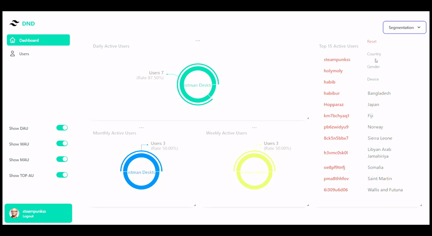

# Simple DND

Simple dnd dashboard with DAU, WAU, MAU, using mern.

## Used Technogies in Backend
- [Express js](https://expressjs.com/en/starter/installing.html)
- [Sequelize](https://sequelize.org/docs/v6/), [Sequelize-cli](https://github.com/sequelize/cli), [Mysql2](https://www.npmjs.com/package/mysql2)
- Sequlize [migrations](https://sequelize.org/docs/v6/other-topics/migrations/)
- Sequelize [seeders](https://sequelize.org/docs/v6/other-topics/migrations/#creating-the-first-seed)
- Sequlize [transparent cache](https://github.com/DanielHreben/sequelize-transparent-cache)
- [Ioredis](https://www.npmjs.com/package/ioredis)
- [Bcryptjs](https://www.npmjs.com/package/bcryptjs)
- [Device Detector Js](https://www.npmjs.com/package/device-detector-js)
- [Json Web Token](https://www.npmjs.com/package/jsonwebtoken)
- [Faker Js](https://fakerjs.dev/guide/#overview)

## Used Technologies in Frontend
  - [Vite JS](https://vitejs.dev/)
  - [Vite Plugin Chunk Split](https://www.npmjs.com/package/vite-plugin-chunk-split)
  - [React JS](https://reactjs.org/)
  - React [DOM](https://reactjs.org/docs/react-dom.html), [Router DOM](https://v5.reactrouter.com/web/guides/quick-start)
  - [Tailwind](https://tailwindcss.com/docs/installation), [Autoprefixer](https://github.com/postcss/autoprefixer), [Postcss](https://postcss.org/)
  - [Headless UI](https://headlessui.com/)
  - [Axios](https://github.com/axios/axios)
  - [Recharts](https://recharts.org/en-US/)
  - [React Grid Layout](https://github.com/react-grid-layout/react-grid-layout#usage)

## Backend

### Installation

Run Install -
`npm install`

Set database info in `config/config.json`

Set JWT secret in `config/jwt.config.js` or at environtment variables

    JWT_SECRET=
    JWT_EXPIRES=

Run migration to migrate tables - 
`npx sequelize-cli db:migrate`

Run seeders to populate users table - 

`npx sequelize-cli db:seed:all`
Password: `password`

Start Server -
`npm run server`

server will be started at port 3000

### Module Usage

Creating a module `test.js` under controllers, helpers, models or responses

    module.exports = {
        name: "TestModule",
        helloWorld: () => {
            return "This is a test";
        }
    }

Using TestModule methods -

    const { TestModule } = require("test");
    
    TestModule.helloWorld();

### Router Usage

Creating a router `test.router.js` under routers

    const { yourmiddleware } = require("../middleware");
    const { YourController } = require("../controllers");

    module.exports = (router) => {

        // Middleware
        router.use(yourmiddleware);

        // Your Routes
        router.get("/test", YourController.helloWorld);

        return router;
    }

### Redis Cache Usage
Binding sequelize models using cache -

    const { CacheModel } = require("../redis");
    const { User } = require("../models");

    // Load user from cache
    const user = await CacheModel(User).cache().findByPk(1);

Using IORedis default methods

    const { Cache } = require("../redis");
    
    Cache.set("mykey", "value"); // Returns a promise which resolves to "OK" when the command succeeds.

    // use node.js callback style

    Cache.get("mykey", (err, result) => {
        if (err) {
            console.error(err);
        } else {
            console.log(result); // Prints "value"
        }
    });

    //OR

    await Cache.get("mykey");

## Frontend

### Installation

Run Install -
`npm install`

Set api url in `.env` Environment variable
`VITE_API_URL = http://yourapi.com`

Run in development - 
`npm run dev`

Build in production - 
`npm run build`